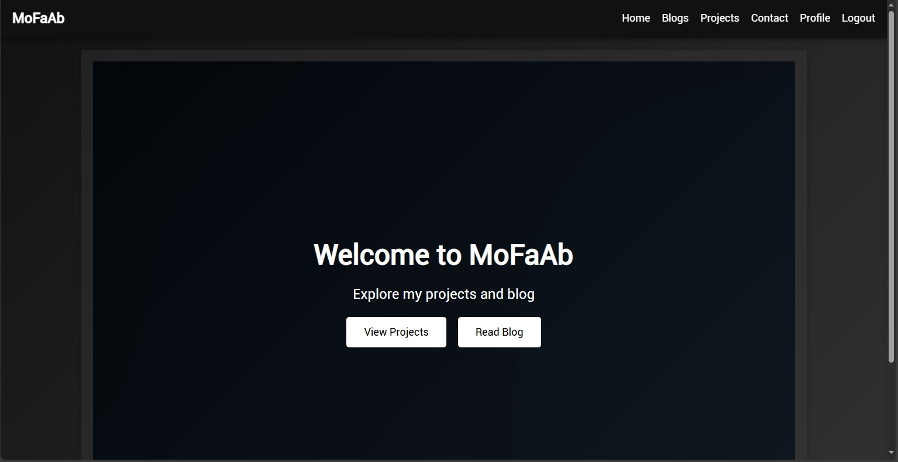

# MoFaAb

## Introduction
MoFaAb is a portfolio project designed to showcase my skills and projects. It includes a blog section, a projects section, and a contact form. The project is built using Flask, a lightweight WSGI web application framework in Python.

## Links
- **Landing page:** [MoFaAb](https://fakhry0.github.io/my-landing-page/)
- **Final Project Blog Article:** [Read the Blog](https://www.linkedin.com/pulse/building-mofaab-my-portfolio-project-muhammad-fakhry-filtf/?trackingId=qkiS68KKQuCBzT0Q4enhAg%3D%3D)
- **Author's LinkedIn:** [Muhammad Fakhry](https://www.linkedin.com/in/muhammad-fakhry/)

## Installation
To get a local copy up and running, follow these simple steps:

1. **Clone the repo**
   ```sh
   git clone https://github.com/your-username/mofaab.git
   ```

2. **Install dependencies**
   ```sh
   pip install -r requirements.txt
   ```

3. **Set up the database**
   ```sh
   flask db upgrade
   ```

4. **Run the application**
   ```sh
   flask run
   ```

## Usage
Once the application is running, you can navigate to the following sections:

- **Home:** The landing page with links to view projects and read the blog.
- **Blogs:** A list of blog posts.
- **Projects:** A list of projects with details and links.
- **Contact:** A form to contact the author.
- **Profile:** Update your profile information (for authenticated users).
- **Admin Dashboard:** Manage users, projects, and blog posts (for admin users).

## Contributing
Contributions are what make the open-source community such an amazing place to learn, inspire, and create. Any contributions you make are **greatly appreciated**.

1. Fork the Project
2. Create your Feature Branch (`git checkout -b feature/AmazingFeature`)
3. Commit your Changes (`git commit -m 'Add some AmazingFeature'`)
4. Push to the Branch (`git push origin feature/AmazingFeature`)
5. Open a Pull Request

## Licensing
copyright: Muhammad Fakhry.

## Inspiration and Challenges
This project was inspired by the need to have a personal portfolio that showcases my work and skills. The main challenge was integrating various features like user authentication, file uploads, and admin functionalities. I struggled with setting up the database relationships and ensuring the security of user data. In the next iteration, I plan to add more interactive features and improve the UI/UX.

## Technical Details
The project uses Flask for the backend and Jinja2 for templating. The database is managed using SQLAlchemy, and user authentication is handled by Flask-Login. Below are some key code snippets:

### Project Detail Template

